# MomentAI

MomentAI is a production-oriented video intelligence SaaS foundation. It accepts uploaded videos, extracts technical metadata, detects scenes, generates timestamped transcripts, deterministically ranks notable moments, and exports those moments as downloadable MP4 clips and ZIP packages.

The current release is **Milestone 6A**. Analysis and export run locally through FastAPI, FFmpeg, FFprobe, and faster-whisper. The Moment Intelligence Engine (MIE) is deterministic; no Gemini, OpenAI, or other semantic AI provider is implemented yet.

## Project overview

MomentAI currently provides:

- Streamed video uploads with extension and size validation
- FFprobe metadata extraction
- Middle-frame and per-scene thumbnails
- FFmpeg-based scene detection
- faster-whisper transcription with timestamped, scene-mapped segments
- Deterministic moment scoring, ranking, and explanations
- Immutable, reusable analysis results
- Synchronous ranked-moment export
- Five FFmpeg output presets
- Validated MP4 clips, versioned manifests, checksums, and ZIP packages
- Local artifact storage with temporary-file cleanup

Supported source extensions are `.mp4`, `.mov`, `.mkv`, `.avi`, and `.webm`.

## Architecture

```mermaid
flowchart LR
    Client["Next.js client or API consumer"] --> API["FastAPI routes"]
    API --> Storage["Upload storage"]
    Storage --> Video["VideoService / FFprobe"]
    Video --> Scenes["SceneService / FFmpeg"]
    Scenes --> Transcript["TranscriptService / faster-whisper"]
    Transcript --> MIE["Moment Intelligence Engine"]
    MIE --> Analysis["Immutable AnalysisResult"]
    Analysis --> Moments["Ranked moments response"]
    Analysis --> Planner["ExportPlanner"]
    Planner --> Extractor["ClipExtractor / FFmpeg"]
    Extractor --> Validator["FFprobeOutputValidator"]
    Validator --> Artifacts["LocalArtifactStorage"]
    Artifacts --> Package["Manifest, checksums, and ZIP"]
    Package --> Downloads["Download endpoints"]
```



Application boundaries:

```text
backend/app/
├── api/routes/       FastAPI request and download handlers
├── core/             Configuration, logging, and version metadata
├── schemas/          Pydantic API contracts
├── services/         Video, scene, transcript, storage, and pipeline services
├── intelligence/     Deterministic Moment Intelligence Engine
└── exporting/        Synchronous export planning, extraction, validation, and packaging
```

Runtime directories:

```text
uploads/              Stored source uploads
thumbnails/           Analysis and scene thumbnails
clips/exports/        Published clips, manifests, checksums, and packages
frames/               Reserved runtime directory
temp/                 Whisper cache and temporary processing artifacts
```

Runtime media is excluded from Git.

## Current pipeline

```text
Upload
  ↓
VideoService
  ↓
SceneService
  ↓
TranscriptService
  ↓
Moment Intelligence Engine
  ↓
Immutable AnalysisResult
  ├──→ /api/v1/moments response
  └──→ ExportEngine
          ↓
       ExportPlanner
          ↓
       FFmpeg clip extraction
          ↓
       FFprobe validation
          ↓
       Manifest + checksums + ZIP package
```

`MomentPipelineService` performs analysis once and returns an immutable `AnalysisResult` containing the source fingerprint, video metadata, scenes, optional transcript, MIE result, and diagnostics. The moments route serializes this result. The export route passes the same result object to `ExportEngine`; `ExportEngine` cannot invoke or rerun the analysis pipeline.

Transcript failure is degradable. A video without usable audio can still produce scene-based ranked moments and exports, with a structured transcript diagnostic.

## Implemented milestones

| Milestone | Status | Delivered capability |
|---|---:|---|
| Phase 1 | Complete | FastAPI and Next.js foundation, CORS, health check, upload UI and storage directories |
| Milestone 2 | Complete | FFprobe metadata extraction, logging, corrupted-video handling |
| Milestone 3 | Complete | Video analysis endpoint and middle-frame thumbnail generation |
| Milestone 4A | Complete | Scene detection, scene boundaries, durations, and thumbnails |
| Milestone 4B | Complete | Audio extraction, faster-whisper transcription, timestamped segments, scene mapping |
| Milestone 5A | Complete | Modular deterministic Moment Intelligence Engine foundation |
| Milestone 5B | Complete | Real scene/transcript pipeline integration and ranked moments API |
| Milestone 6A | Complete | Synchronous clip export, presets, validation, manifests, ZIP packaging, and downloads |

## Moment Intelligence Engine

The MIE is a modular deterministic ranking system in `backend/app/intelligence/`.

Current analyzers:

- `SceneStructureAnalyzer`: scores scene duration and timeline position
- `TranscriptActivityAnalyzer`: scores transcript word density and coverage

The engine provides:

- Analyzer metadata: ID, version, priority, dependencies, estimated cost, and cacheability
- Deterministic cache-key generation interfaces
- Dependency-aware analyzer execution
- Failure isolation and graceful dependent-analyzer skipping
- Ranking profiles containing weights and thresholds
- Weighted deterministic signal fusion
- Ranked moments with confidence and signal contributions
- Deterministic insight generation for explainability

The default profile is `default`. The architecture supports future profiles such as gaming, podcast, sports, and animals without changing engine logic.

The MIE does not currently include semantic AI, face detection, emotion recognition, motion analysis, or viral prediction. Those can be added later as independent analyzers.

## Export Engine

Milestone 6A implements a synchronous Export Engine in `backend/app/exporting/`. The HTTP request remains open until analysis, extraction, validation, and packaging complete.

The export layer is independent from scoring:

- `ExportPlanner` reads ranked timestamps and creates clip specifications
- `FFmpegCommandBuilder` creates shell-free FFmpeg argument arrays
- `FFmpegProcessRunner` handles execution, timeouts, cancellation, and diagnostics
- `ClipExtractor` extracts one clip at a time
- `FFprobeOutputValidator` verifies duration, dimensions, streams, codecs, and file size
- `LocalArtifactStorage` controls paths and atomically publishes validated artifacts
- `ZipPackageBuilder` creates the downloadable package without recompressing MP4 data

### Export presets

| Preset | Intended use | Output behavior |
|---|---|---|
| `standard` | General export | H.264/AAC, original dimensions, balanced quality |
| `preview` | Fast lightweight preview | Faster encode, higher compression, 854×480 target |
| `high_quality` | High-quality archive | Slower encode, lower CRF, higher audio bitrate |
| `youtube_shorts` | Vertical delivery canvas | H.264/AAC, 1080×1920 padded output, 30 fps |
| `tiktok` | Vertical delivery canvas | H.264/AAC, 1080×1920 padded output, 30 fps |

The vertical presets currently scale and pad content. Intelligent subject-aware reframing is reserved for a future milestone.

### Export package

```text
momentai-export-{export_id}.zip
├── manifest.json
├── checksums.sha256
└── clips/
    ├── moment-001.mp4
    └── moment-002.mp4
```

Every manifest includes:

- `manifest_version`
- `momentai_version`
- `pipeline_version`
- `mie_version`
- Source filename, fingerprint, and metadata
- Ranking profile and export preset
- Clip ranks, timestamps, scores, confidence, contributions, and insights
- Output stream metadata, sizes, and SHA-256 checksums
- Pipeline diagnostics
- A reserved transform list for future subtitles and vertical reframing

Clip files are written to temporary `.part.mp4` paths, validated with FFprobe, and atomically published only after validation succeeds. Failed exports remove incomplete artifacts.

## API endpoints

The default API prefix is `/api/v1`.

| Method | Endpoint | Purpose | Success status |
|---|---|---|---:|
| `GET` | `/api/v1/health` | Service health check | 200 |
| `POST` | `/api/v1/uploads` | Upload a video and extract metadata | 201 |
| `POST` | `/api/v1/analyze` | Extract metadata and create a middle thumbnail | 201 |
| `POST` | `/api/v1/scenes` | Detect logical scenes and create scene thumbnails | 201 |
| `POST` | `/api/v1/transcript` | Generate timestamped transcript segments | 201 |
| `POST` | `/api/v1/moments` | Produce deterministic ranked moments | 200 |
| `POST` | `/api/v1/exports` | Analyze and synchronously export ranked moments | 201 |
| `GET` | `/api/v1/exports/{export_id}/clips/{clip_id}` | Download an exported MP4 clip | 200 |
| `GET` | `/api/v1/exports/{export_id}/manifest` | Download the JSON export manifest | 200 |
| `GET` | `/api/v1/exports/{export_id}/package` | Download the ZIP package | 200 |

All upload endpoints use `multipart/form-data` with the source video in the `file` field.

### Export request fields

`POST /api/v1/exports` accepts:

| Field | Default | Description |
|---|---:|---|
| `file` | Required | Source video |
| `profile` | `default` | MIE ranking profile |
| `preset` | `standard` | FFmpeg export preset |
| `top_k` | `5` | Number of top-ranked moments, from 1 to 20 |
| `selected_ranks` | Empty | Optional comma-separated ranks, for example `1,3` |
| `padding_before_seconds` | `0` | Leading padding from 0 to 30 seconds |
| `padding_after_seconds` | `0` | Trailing padding from 0 to 30 seconds |

Interactive API documentation is available at `/docs` while the backend is running.

## Installation

### Prerequisites

- Python 3.14
- Node.js 20.9 or newer
- FFmpeg and FFprobe available in `PATH`
- npm

Verify the media tools:

```powershell
ffmpeg -version
ffprobe -version
```

### Backend

From the repository root:

```powershell
py -3.14 -m venv .venv
.\.venv\Scripts\Activate.ps1
python -m pip install --upgrade pip
python -m pip install -r requirements.txt
Copy-Item .env.example .env
```

The configured faster-whisper model is downloaded into `temp/whisper-models` when it is first needed unless it is already cached.

### Frontend

```powershell
Set-Location frontend
npm install
Copy-Item ..\.env.example .env.local
```

The frontend reads `NEXT_PUBLIC_API_BASE_URL`, which defaults to `http://localhost:8000` in `.env.example`.

## Running locally

Start the backend from the repository root:

```powershell
.\.venv\Scripts\Activate.ps1
uvicorn backend.app.main:app --reload
```

The backend runs at `http://localhost:8000`.

In another terminal, start the frontend:

```powershell
Set-Location frontend
npm run dev
```

The frontend runs at `http://localhost:3000`.

Important environment settings include:

```text
MOMENTAI_MAX_UPLOAD_SIZE_MB
MOMENTAI_UPLOAD_DIR
MOMENTAI_THUMBNAIL_DIR
MOMENTAI_FFMPEG_BINARY
MOMENTAI_FFPROBE_BINARY
MOMENTAI_SCENE_DETECTION_TIMEOUT_SECONDS
MOMENTAI_WHISPER_MODEL_SIZE
MOMENTAI_TRANSCRIPTION_TIMEOUT_SECONDS
MOMENTAI_EXPORT_DIR
MOMENTAI_EXPORT_TEMP_DIR
MOMENTAI_EXPORT_FFMPEG_TIMEOUT_SECONDS
MOMENTAI_EXPORT_FFPROBE_TIMEOUT_SECONDS
```

See `.env.example` for the complete configuration.

## Testing

Run the complete backend unit and service-integration suite from the repository root:

```powershell
.\.venv\Scripts\Activate.ps1
python -m unittest discover -v
python -m pip check
```

Verify that every backend module imports:

```powershell
python -c "import importlib, pkgutil, backend.app; [importlib.import_module(m.name) for m in pkgutil.walk_packages(backend.app.__path__, backend.app.__name__ + '.')]"
```

Run frontend checks:

```powershell
Set-Location frontend
npm run lint
npm run build
```

Real-media integration testing requires FFmpeg, FFprobe, and the configured faster-whisper model. The export smoke test should verify source cleanup, MP4 readability, manifest versions, checksums, ZIP integrity, download endpoints, transcript degradation for silent video, and backward compatibility with existing endpoints.

## Roadmap

### Milestone 6B: asynchronous export execution

- Durable export jobs and status persistence
- Background worker execution
- Queue abstraction and backpressure
- Progress polling and Server-Sent Events
- Retry and stalled-job recovery
- Bounded parallel clip extraction

### Media delivery

- Object storage and signed download URLs
- Retention and cleanup policies
- Subtitle sidecars and burned-in captions
- Intelligent vertical reframing
- Additional codecs, containers, and device presets

### Intelligence expansion

- Motion and audio-energy analyzers
- Face and emotion signals
- Semantic AI provider adapters
- Domain ranking profiles
- Viral-potential research and evaluation
- Persistent analysis caching

### SaaS production readiness

- Authentication and authorization
- Tenant isolation and quotas
- Database-backed assets and analysis history
- Billing and subscription enforcement
- Observability, tracing, and operational metrics
- Rate limiting, malware scanning, and content controls
- Cloud deployment and horizontal scaling
